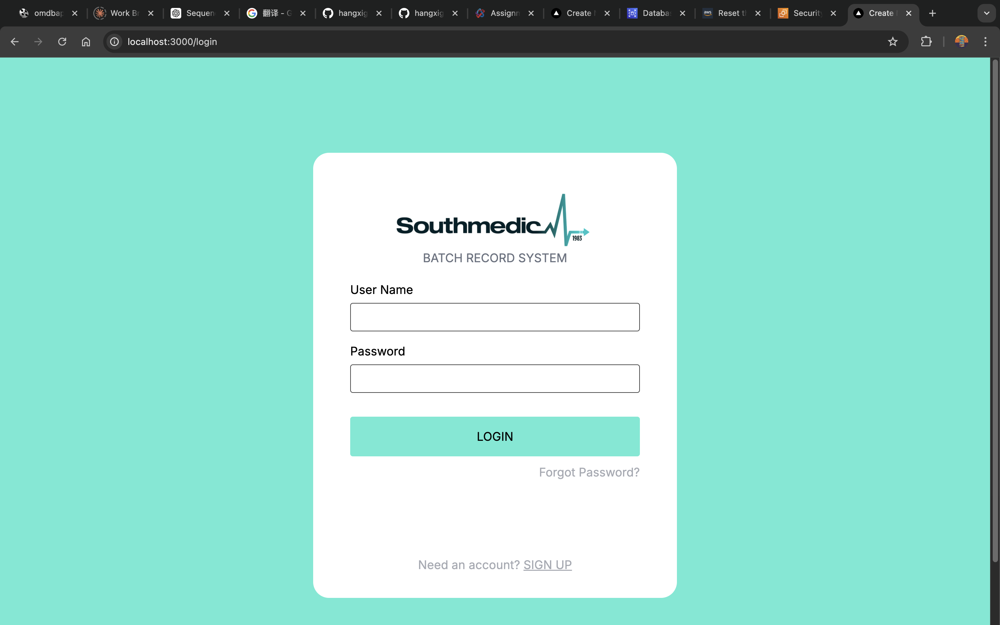
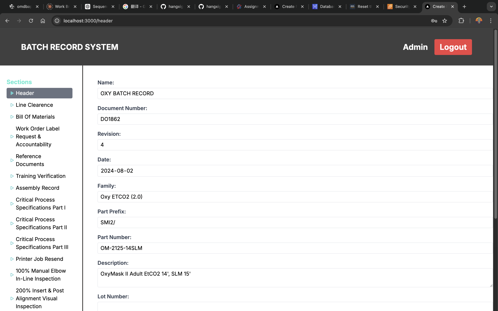

## Getting Started

First, run the development server:

```bash
npm install
npm run dev
```

Open [http://localhost:3000/login](http://localhost:3000/login) with your browser to login

username: Admin

password: WantSleepSMI

then you can edit and submit the form.



